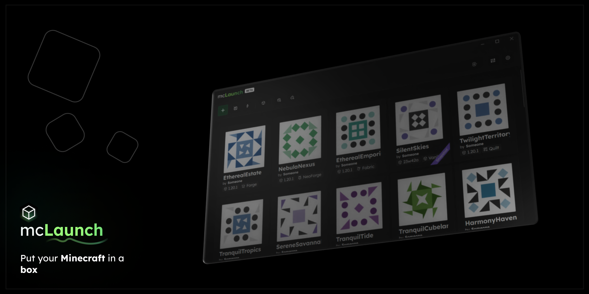
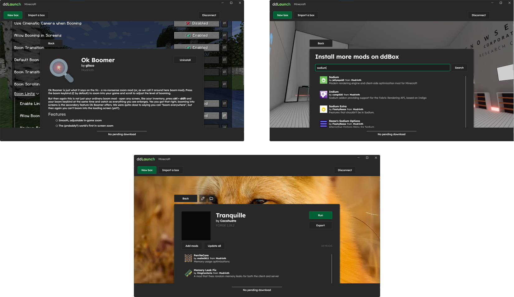

> This project is in a very early stage, some things just don't work or aren't implemented yet !

<h3 align="center">mcLaunch</h3>

<p align="center">The Minecraft launcher that puts your Minecraft in a box 📦</p>




# Features

+ Launches Minecraft 1.7.10 up to 1.19.4 🚀
+ Supports Fabric and Forge 📜
+ Installs mods from CurseForge and Modrinth 🧩
+ Imports modpacks from CurseForge 🛬
+ Exports modpacks to a really small file format 🛫

# Install

Work in progress

# Build

Make sure to have the **.NET 7.0 SDK** installed, then clone and build the project :

```shell
$ cd ddLaunch
$ dotnet build
```

Then, you can run the project :
```shell
$ dotnet run
```

# Credits

Libraries used by the project :
+ Avalonia (UI Library)
+ ReactiveUI (UI Library)
+ Modrinth.Net (for Modrinth)
+ CurseForge.NET (for CurseForge)
+ K4os.Compression.LZ4 (compression, used by the Box Binary format)
+ ReverseMarkdown (to render mod pages)
+ CmlLib.Core.Auth.Microsoft.MsalClient (for logging in with Microsoft)
+ Markdown.Avalonia (to render mod pages)
+ SharpNBT (for reading world's level.dat files)

Projects that helped the development of this project
+ [portablemc](https://github.com/mindstorm38/portablemc) (general Minecraft launcher stuff + Forge installer wrapper code)
